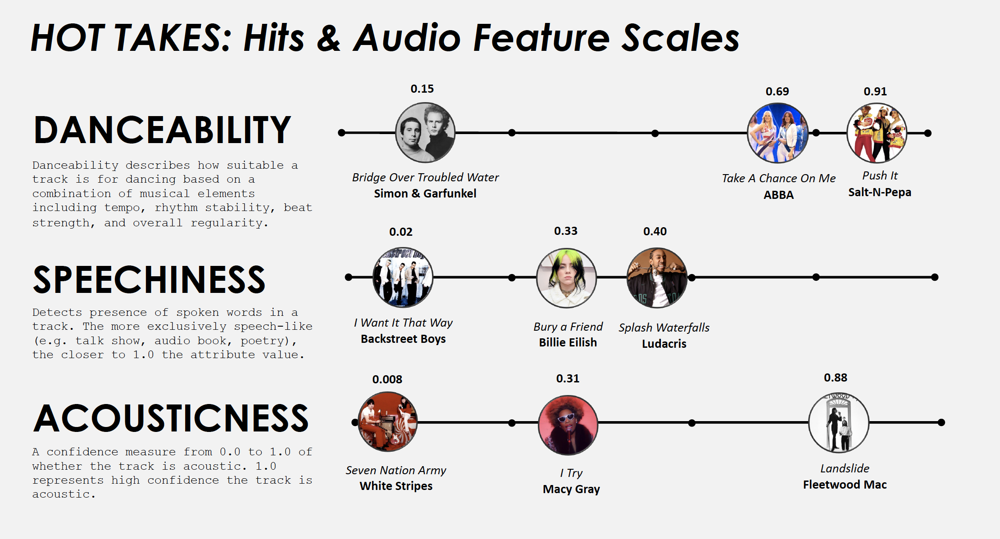
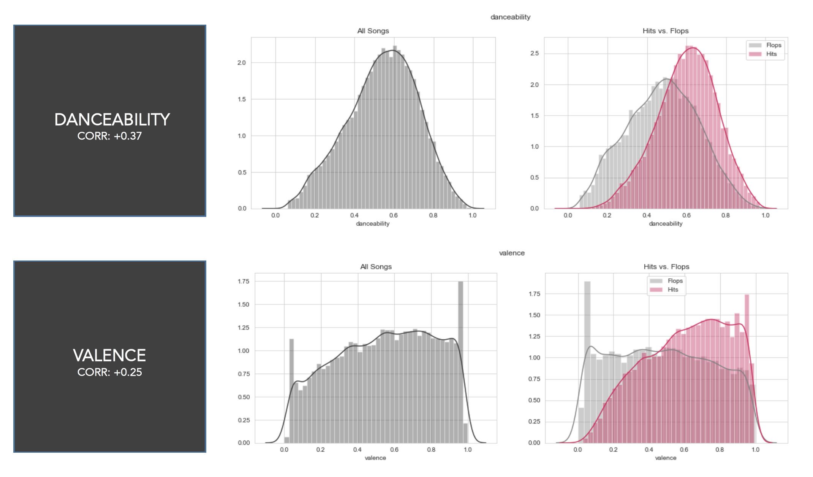
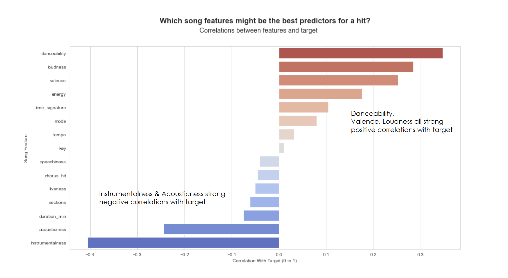
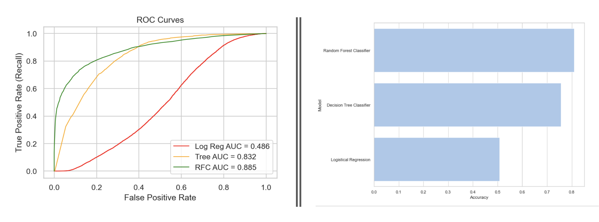

# Predicting Billboard Hit Songs Based on Song Attributes

This project aims to predict whether or not a song becomes a "hit" on Billboard's Top 100 list based on song attribute information taken from Spotify (e.g. Danceability, Valence, Instrumentallness, Tempo, etc).

## Data

Data for this project was taken from a [Kaggle](https://www.kaggle.com/theoverman/the-spotify-hit-predictor-dataset) dataset by Farooq Ansari. The author of the dataset used Billboard and Spotify API's to compile information. The dataset is comprised of several decades worth of songs (1960s to 2010s), totaling over 40K.
songs. 

Daa Dictionary can be found directly on the [Kaggle page](https://www.kaggle.com/theoverman/the-spotify-hit-predictor-dataset).

The author of the dataset defines a "hit" vs. a "flop" based on the following criteria:

        - The track must not appear in the 'hit' list of that decade.
        - The track's artist must not appear in the 'hit' list of that decade.
        - The track must belong to a genre that could be considered non-mainstream and / or avant-garde. 
        - The track's genre must not have a song in the 'hit' list.
        - The track must have 'US' as one of its markets.

## EDA

From initial EDA, the features with the strongest positive correlations with the target (hit/value) appear to be song's **danceability** and **valence**. On the opposite end of hte spectrum, a song's **instrumentallness** and **acousticness** exhibit a strong negative correlation with the target.

## Data Models

This project used 3 different data models to predict hit songs:
- Logistic Regression
- Decision Tree
- Random Forest

Of the models tested, Random Forest yielded the best results.

## Conclusions
- Logistic Regressions not so great with many variables, not the best with categorical variables
- Decision Tree better than LR – very clear to interpret- but puts a heavy emphasis on one feature (instrumentalness)
- Random Forest produced the best outcome with predictions, harder to interpret given the nature of the model
- Hit songs are influenced a lot by level of “instrumentalness” – needs to have words! Acousticness and danceability also seem to play a role

